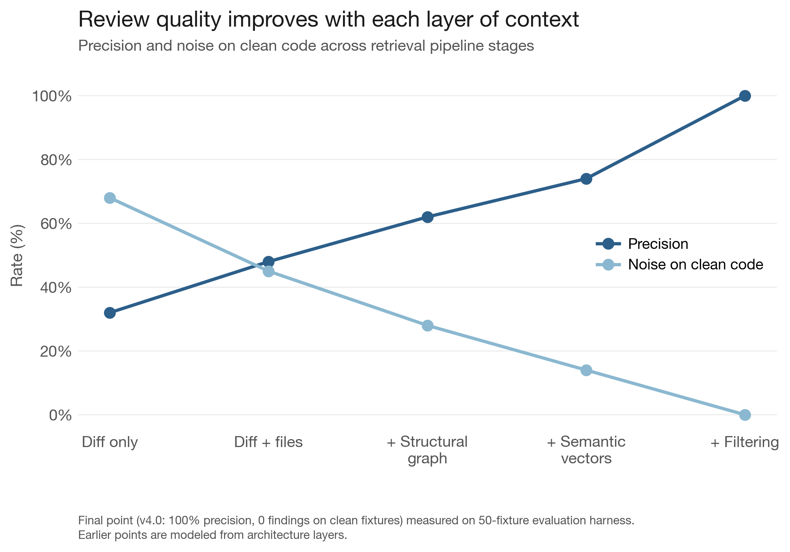
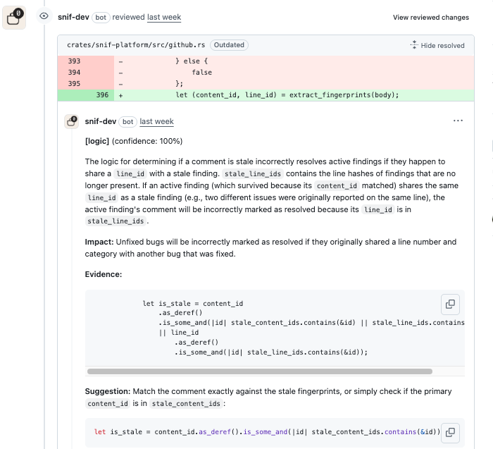
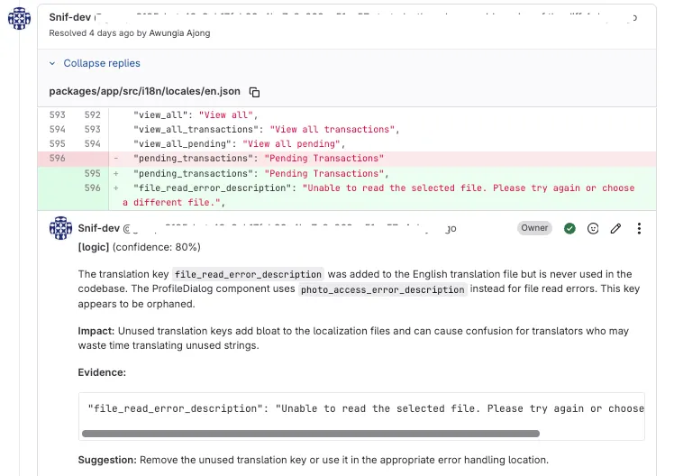

# **Snif**


<div align="left">
  <a href="https://github.com/AssahBismarkabah/Snif/blob/main/LICENSE"></a>
  <a href="https://github.com/AssahBismarkabah/Snif/releases/latest"></a>
  <a href="./docs"></a>
</div>

# Context-Aware AI Code Review Agent

Snif is a code review agent that understands your codebase. It indexes the
repository structure, generates semantic summaries, and uses that context to
review pull requests with specific, evidenced, and actionable findings.

It ships as a single Rust binary for CI pipelines. On each commit, it builds a
structural graph, generates LLM summaries, and embeds them for search. On each
pull request, it retrieves related code using structural, semantic, and keyword
methods, then runs a single review call and posts only findings that survive
aggressive filtering.

<hr>


<p align="left">
  
</p>

# Getting Started

## Prerequisites

Rust toolchain (1.70+). An OpenAI-compatible LLM provider endpoint and API key.

## Build

```
cargo build --release
```

The binary is at `target/release/snif`.

## Configure

Copy the example configuration to your repository root:

```
cp .snif.json.example .snif.json
```

Edit `.snif.json` to set your LLM provider. At minimum you need the endpoint
and model names:

```json
{
  "model": {
    "review_model": "gpt-4o",
    "summary_model": "gpt-4o-mini",
    "endpoint": "https://api.openai.com/v1"
  }
}
```

Set the API key as an environment variable:

```
export SNIF_API_KEY=your-api-key
```

See [Configuration](./docs/configuration.md) for all options, provider
examples, and environment variables.

## Index

Build the repository index. This parses source files, builds the structural
graph, generates LLM summaries, and computes vector embeddings.

```
snif index --path /path/to/repo
```

Use `--full` for a clean rebuild. Without it, indexing is incremental.

## Review

Review a code change using a local diff file:

```
git diff main > /tmp/change.diff
snif review --path /path/to/repo --diff-file /tmp/change.diff
```

Review a GitHub pull request directly:

```
GITHUB_TOKEN=your-token snif review --repo owner/repo --pr 123
```

Findings are printed to stdout as JSON. When using `--repo` and `--pr`,
findings are also posted as inline review comments on the pull request.

## Evaluate

Run the evaluation harness against benchmark fixtures:

```
snif eval --fixtures ./fixtures/
```

The command exits with code 0 if quality gates pass and code 1 if they fail.

## Clean

Remove all local runtime data (index database, embedding cache, feedback store):

```
snif clean
```

This does not touch your source code or configuration — only Snif's generated
data.

## Examples



# Documentation

- [Configuration](./docs/configuration.md)  setup, config format, CLI reference
- [CI Integration](./docs/ci.md)  GitHub Actions, GitLab CI, Docker, generic CI
- [Bot Identity](./docs/bot-identity.md)  GitHub App and GitLab bot user setup
- [Testing](./docs/testing.md)  local testing and evaluation
- [Product](./docs/product.md)  scope, delivery plan, success criteria
- [Architecture](./docs/architecture.md)  system design, modules, data flows
